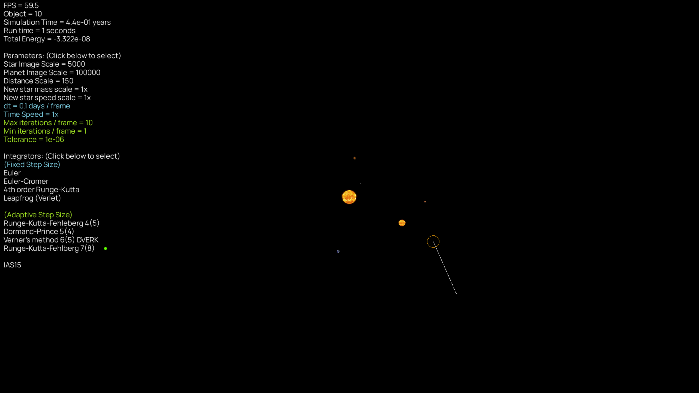

# Gravity Simulator
Interactive Newtonian N-body gravity simulator accelerated with C library.



## Online demo: 
Link: https://alvinng4.github.io/Gravity_Simulator_Web/

Click *once* after you see the green loading bar showing
"Ready to start!". You should then see the main
menu. From there, simply select a system to start. 
See [controls](#controls) for basic controls.

This online demo is built with the pygbag package. 

> [!Warning]\
> In Safari, if you accidently selected/clicked the window,
> the FPS would drops significantly. To fix it, simply click
> on something else outside the game window.


## Documentation
* [Quick Start](#quick-start)
    - [Python version](#python-version)
    - [Installation](#installation)
* [Running the program](#running-the-program)
    - [C library / Numpy (Optional)](#c-library--numpy-optional)
    - [Changing the resolution (Optional)](#changing-the-resolution-optional)
* [Available systems](#available-systems)
* [Controls](#controls)
* [Available integrators](#available-integrators)
    - [Fixed step size methods](#fixed-step-size-methods)
    - [Embedded Runge-Kutta methods](#embdedded-runge-kutta-methods)
    - [IAS15](#IAS15)
* [Program keeps crashing. What should I do?](#program-keeps-crashing-what-should-i-do)
* [Feedback and Bugs](#feedback-and-bugs)
* [Data Sources](#data-sources)
* [References](#references)
* [Acknowledgement](#acknowledgement)

## Quick Start

### Python version
This program requires Python version 3.10 or higher. 

### Installation
Download the source files, or clone this repository by running the following command in terminal:
```
git clone https://github.com/alvinng4/orbit_sim
```
Install the required packages by
```
pip install .
```

## Running the program
Once you have downloaded the source files, navigate to the source directory in terminal and run
```
python gravity_sim [-n|--numpy] [-r|--resolution <width> <height>]
```

### C library / Numpy (Optional)
By default, the simulation is performed in C to improve performance.
If you want to use numpy, run the program with
```
python gravity_sim [-n|--numpy]
```

### Changing the resolution (Optional)
The default resolution is set to the user's screen size. However, you can set your own resolution by the following command:
```
python3 gravity_sim [-r|--resolution <width> <height>]
```

## Available systems
| System | Description |
|:-------|:------------| 
| Void | Emptiness |
| figure-8 | A "figure-8" orbit involving three stars  |
| pyth-3-body | Three stars arranged in a triangle with length ratios of 3, 4, and 5 |
| solar_system | Solar System with the Sun and the planets |

> [!TIP]\
> Pythagorean three body orbit is a highly chaotic orbit with close encounters, which is useful to test the difference
between fixed and variable step size integrators.
For RK4, the largest dt to produce desired result is 2e-8 days.

## Controls

| Action | Control |
|:-------|:------------| 
| Move camera | `W` `A` `S` `D`/ `↑` `↓` `←` `→`|
| Menu | `Esc`|
| Pause | `P` |
| Toggle full-screen mode | `F` |
| Hide user interface | `H` |
| Reset parameters | `R` |
| Create new star | Hold the right mouse button to create a star + drag the mouse to give it an initial boost. |
| Adjust parameter values| Left-click the parameter on the parameters panel + scroll to change its value. |
| Switch integrators | Left-click the integrator on the integrators panel. |


> [!WARNING]\
> Switching integrators or changing dt in the middle of simulation may produce some numerical error.

## Available integrators 
### Fixed step size methods
Fixed step size integrators are simple methods to simulate the system with the given step size dt.
| Fixed step size methods |
|:-----------|
| Euler |
| Euler Cromer |
| Fourth Order Runge-Kutta (RK4) |
| Leapfrog |

### Embedded Runge-Kutta methods
Embedded RK methods are adaptive methods that decides the step size automatically based on the estimated error. The system would adopt smaller step size for smaller tolerance.

| Embdedded Runge-Kutta methods | Recommended tolerance* |
|:-----------|:-------------|
| Runge–Kutta–Fehlberg 4(5) | 1e-8 to 1e-14 |
| Dormand–Prince method (DOPRI) 5(4) | 1e-8 to 1e-14 |
| Verner's method (DVERK) 6(5) | 1e-8 to 1e-14 |
| Runge–Kutta–Fehlberg 7(8) | 1e-4 to 1e-8 |

### IAS15
IAS15 (Implicit integrator with Adaptive time Stepping, 15th order) [1] is a highly optimized and efficient integrator. It is the default method of the plotting module.

Recommended tolerance*: 1e-9

*For reference only

## Feedback and Bugs
If you find any bugs or want to leave some feedback, please feel free to let me know by sending an email to alvinng324@gmail.com or open an issue.

## Data Sources
The solar system positions and velocities data at 1/Jan/2024 are collected from the Horizons System [1].
Gravitational constant, and masses of the solar system objects are calculated using the
data from R.S. Park *et. al*. [2].

## References
1. H. Rein, and D. S. Spiegel, 2014, "IAS15: A fast, adaptive, high-order integrator for gravitational dynamics,
accurate to machine precision over a billion orbits", Monthly Notices of the Royal Astronomical Society 446:
1424–1437.
2. Horizons System, Jet Propulsion Laboratory, https://ssd.jpl.nasa.gov/horizons/
3. R. S. Park, et al., 2021, “The JPL Planetary and Lunar Ephemerides DE440 and DE441”, https://ssd.jpl.nasa.gov/doc/Park.2021.AJ.DE440.pdf, Astronomical Journal, 161:105.

## Acknowledgement
The integrators in this project were developed with great assistance from the following book: 
* J. Roa, et al. *Moving Planets Around: An Introduction to N-Body Simulations Applied to Exoplanetary Systems*, MIT Press, 2020